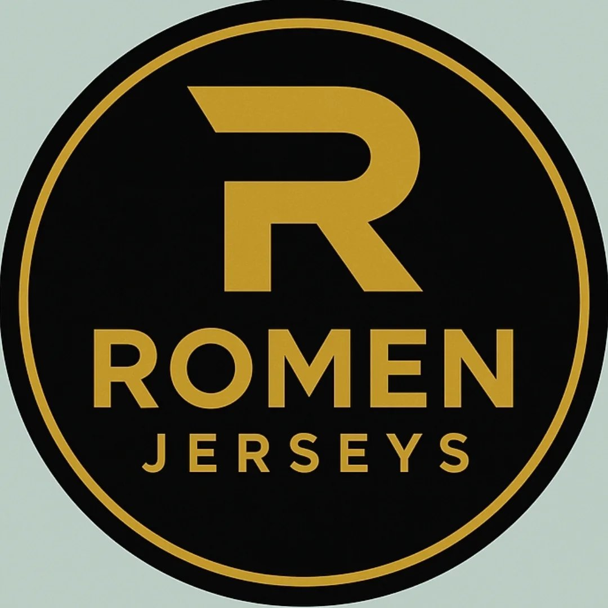
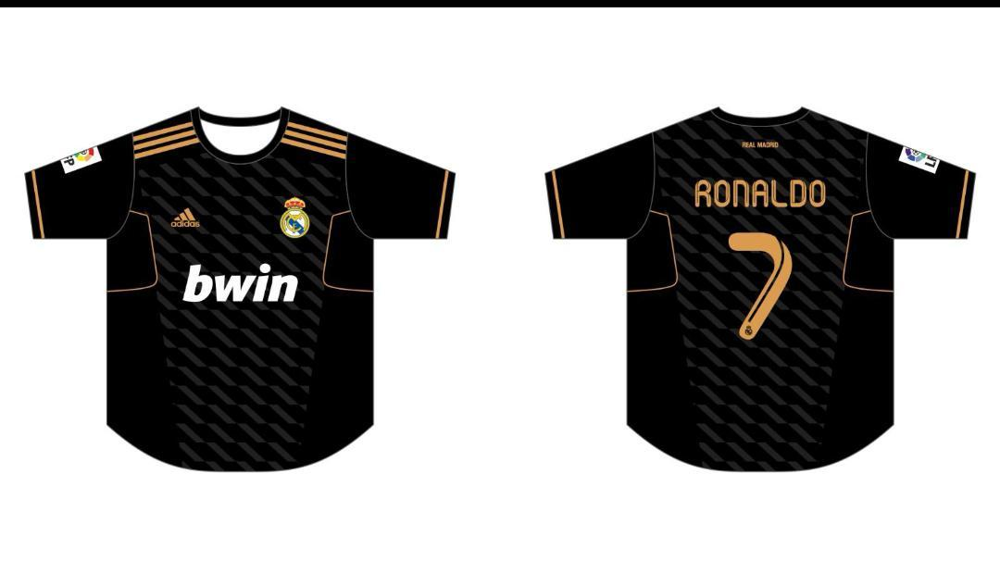
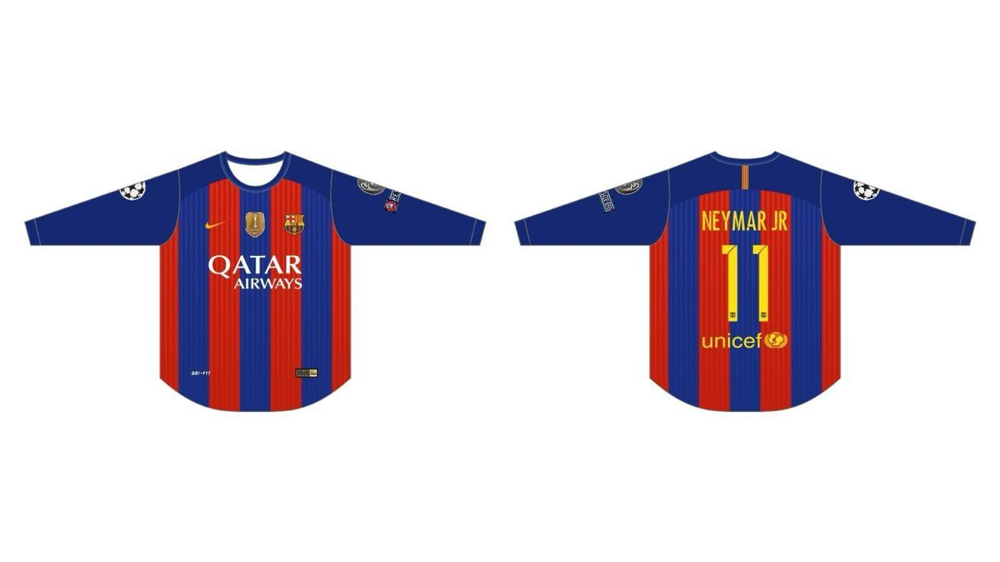
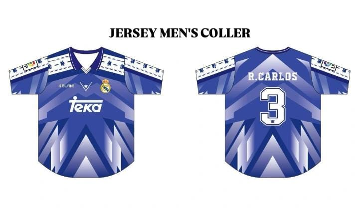

 <!DOCTYPE html><html lang="en">
<head>
  <meta charset="UTF-8" />
  <meta name="viewport" content="width=device-width, initial-scale=1" />
  <title>Romen Jerseys - Premium Custom Jerseys</title>
  <meta name="description" content="Order premium retro, full sleeves and collar jerseys via WhatsApp from Romen Jerseys. Fast delivery, great quality." />
  <link href="https://fonts.googleapis.com/css2?family=Poppins:wght@400;600&display=swap" rel="stylesheet" />
  <link rel="icon" href="romenlogo.png" type="image/png">
  
</head>
<body>
  <header>
    
    
ROMEN JERSEYS

  </header>

  <section id="home">
    

      

        
        <h3>Retro Collection</h3>
      

      

        
        <h3>Full Sleeves</h3>
      

      

        
        <h3>Collar Jersey</h3>
      

    

  </section>

  <section id="jerseys" class="hidden">
    <h2 style="text-align:center; margin-top:2rem;">Jersey Collection</h2>
    <button class="nav-btn" onclick="showPage('home')">🏠 Home</button>
    

  </section>

  <section id="order" class="hidden">
    <button class="nav-btn" onclick="showPage('jerseys')">← Back to Jerseys</button>
    <form id="orderForm">
      <h2>Order Your Jersey</h2>
      
<strong>Selected Jersey:</strong> 

      <label for="name">Name</label>
      <input type="text" id="name" name="name" required />

      <label for="phone">Phone Number</label>
      <input type="tel" id="phone" name="phone" required />

      <label for="address">Address</label>
      <textarea id="address" name="address" rows="3" required></textarea>

      <label for="pincode">Pincode</label>
      <input type="text" id="pincode" name="pincode" required />

      <label for="request">Any Special Request (Optional)</label>
      <textarea id="request" name="request" rows="2"></textarea>

      
⏳ Estimated Delivery: 7–9 working days

      <button type="submit" class="order-btn">Submit Order</button>
    </form>
    
✅ Your order has been placed! You’ll receive details via WhatsApp.

  </section>

  <section class="testimonial">
    <h4>⭐ Customer Reviews</h4>
    
"Amazing quality and fast delivery! Highly recommend."

    
"Customer service is excellent. Will order again."

    
"Got my jersey in 8 days. Looks premium and fits well."

  </section>

  

    &copy; 2025 Romen Jerseys | <a href="mailto:support.romenjerseys@gmail.com">support.romenjerseys@gmail.com</a>
  

  <a href="https://instagram.com/romen_jerseys?igsh=a3drem1naHpiNGwx" class="floating-instagram" target="_blank">📸</a>
  
↑

  
</body>
</html>
